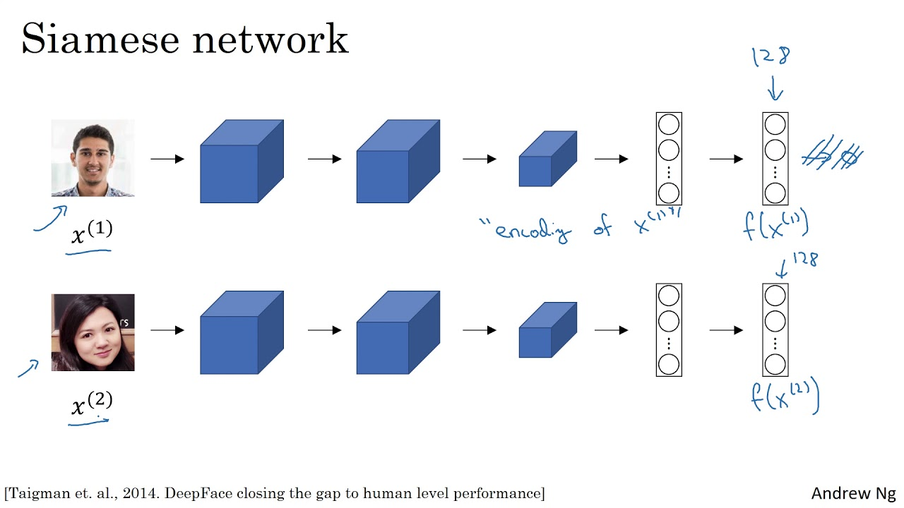

# Face-Recognisition

## Some Useful Terms

#### FaceNet
FaceNet is a Deep Learning architecture consisting of convolutional layers based on GoogLeNet inspired inception models. Having been trained with triplet loss for different classes of faces (by classes I mean faces from different people) to capture the similarities and differences between them.

FaceNet is a Siamese Network.

#### Siamese Network
A Siamese Network is a type of neural network architecture that learns how to differentiate between two inputs. This allows them to learn which images are similar and which are not. These images could be contain faces.

Siamese networks consist of two identical neural networks, each with the same exact weights. First, each network take one of the two input images as input. Then, the outputs of the last layers of each network are sent to a function that determines whether the images contain the same identity.

